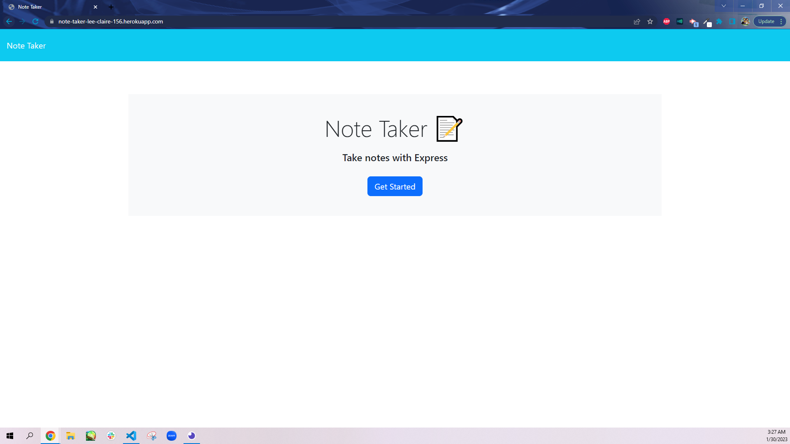
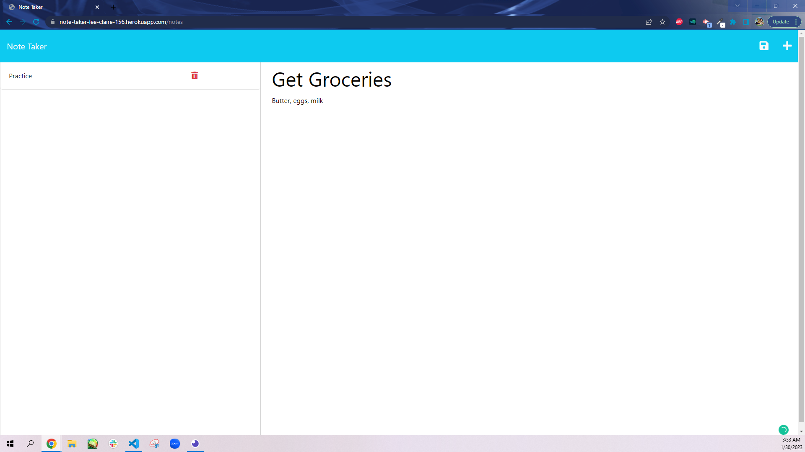
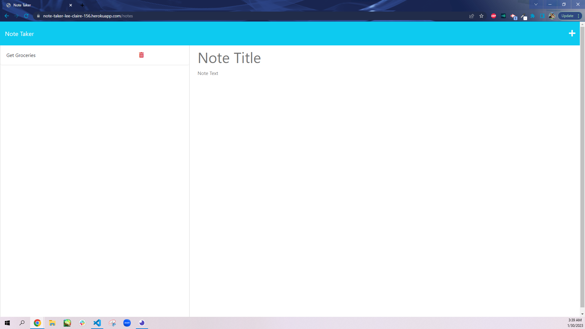

# Team Profile Generator
  
  ## Description

  This project is a Heroku-deployed, note taking application that uses Express.js to save and retrieve data collected from notes stored on a JSON file. A simple note with a title and its details can be saved, where it will be added onto a list of previously created notes on the left side of the webpage. These notes can be viewed later by clicking on their titles or deleted by clicking on the red trash cans associated with them. New notes can be created with the plus (+) sign in the upper right hand corner.

  This project exercised full-stack web development through creating the back-end of an application and connecting it to the front-end technologies that were previously built.

  This application was made by using the following technologies:

  * [Node version 16.18.0 64-bit](https://nodejs.org/en/)
  
  * [Express version 4.16.4](https://expressjs.com/) (installed via Node Package Manager, otherwise known as `npm`)
  
  * [Visual Studio Code](https://code.visualstudio.com/download)
  
  * [GitBash](https://git-scm.com/downloads)
  
  * HTML

  * CSS

  * JS

  ## Usage
  
  * Please click on the following link of the deployed website, https://note-taker-lee-claire-156.herokuapp.com/

  * The application should appear as so on screens upon load:

   

  * To use this application, click on the "Get Started" button on the homepage. Then, add a title to the note and add the note's contents. Afterwards, click on the floppy disk/save icon in the upper right-hand corner, which will only appear once the note's title and text contents are both filled out.

  

  

  * To create a new note, click on the plus sign on the upper right-hand corner.

  * To view an old note, click on its title from the list of notes on the left side of the page.

  

  * To delete a note, click on the red trash can to the right of the note's title.
  
  
  

  ## Credits
  * `path()` function information provided by [Node JS](https://nodejs.org/en/):   https://nodejs.org/api/path.html
  
  * `window.location.pathname` supplemental lesson provided by [W3Schools](https://www.w3schools.com/default.asp):   https://www.w3schools.com/js/js_window_location.asp#:~:text=window.location.hostname%20returns%20the,()%20loads%20a%20new%20document
  
  * What Does "(e)" Mean in JavaScript? - Event Handler Object Explained" supplemental lesson provided by [dcode](https://www.youtube.com/@dcode-software):   https://www.youtube.com/watch?v=_BVkOvpyRI0
  
  * "The Content-Type Header Explained (with examples) | Web Development Tutorial" supplemental lesson provided by [dcode](https://www.youtube.com/@dcode-software):   https://www.youtube.com/watch?v=rh8Kgsex-Us
  
  * `string.prototype.trim()` method supplemental lesson provided by [Mozilla](https://developer.mozilla.org/en-US/):   https://developer.mozilla.org/en-US/docs/Web/JavaScript/Reference/Global_Objects/String/trim
  
  * RESTful APIs in 100 Seconds // Build an API from Scratch with Node.js Express supplemental lesson provided by [Fireship](https://www.youtube.com/@Fireship):   https://www.youtube.com/watch?v=-MTSQjw5DrM
  
  * Killing a localhost information provided by [KavinduWije](https://stackoverflow.com/users/3626371/kavinduwije):   https://stackoverflow.com/questions/39632667/how-do-i-kill-the-process-currently-using-a-port-on-localhost-in-windows
  
  * "How to read and write JSON file using Node.js ?" supplemental lesson provided by [Geeks for Geeks](https://www.geeksforgeeks.org/):   https://www.geeksforgeeks.org/how-to-read-and-write-json-file-using-node-js/

  * `readFile()` function information provided by  [Logan](https://stackoverflow.com/users/751969/logan), [Node JS](https://nodejs.org/en/), and [hey(node)](https://heynode.com/):   https://stackoverflow.com/questions/10058814/get-data-from-fs-readfile    https://nodejs.org/api/fs.html#fs_fs_readfilesync_filename_encoding    https://heynode.com/tutorial/readwrite-json-files-nodejs/

  * Using `Array filter()` method to remove an element from an array by ID credit goes to [Coding Beauty](https://codingbeautydev.com/):   https://codingbeautydev.com/blog/javascript-remove-element-from-array-by-id/#:~:text=splice()%20methods-,To%20remove%20an%20element%20from%20an%20array%20by%20ID%20in,)%20%7B%20const%20objWithIdIndex%20%3D%20arr.

  ## Questions
  
  If you have any questions, my GitHub profile is [www.github.com/leeclaire156](www.github.com/leeclaire156), and my email is [lee.claire156@gmail.com](mailto:lee.claire156@gmail.com).
